<!-- Generated by GitHub Profile Agent Console. Edit profile.config.json, then run npm run generate. -->

  <picture>
    <source media="(max-width: 760px) and (prefers-color-scheme: dark)" srcset="./assets/hero/agent-console-258a625c-mobile-dark.svg">
    <source media="(max-width: 760px)" srcset="./assets/hero/agent-console-258a625c-mobile-light.svg">
    <source media="(prefers-color-scheme: dark)" srcset="./assets/hero/agent-console-258a625c-dark.svg">
    <source media="(prefers-color-scheme: light)" srcset="./assets/hero/agent-console-258a625c-light.svg">
    
  </picture>

  

## About Me

AI Engineer and IEEE-published researcher building and deploying end-to-end AI applications, including a live multi-tenant RAG knowledge assistant and an LLM-powered healthcare platform.

B.Tech CSE-AI, Class of 2026. Seeking entry-level AI/ML, Python backend, or Software Engineering roles.

## Current Focus

| Area | What I am exploring |
| --- | --- |
| **AI Agents** | Autonomous workflows, tool use, evaluation, and reliable agent behavior. |
| **Applied AI** | Turning model capabilities into useful and testable software systems. |
| **Developer Tools** | Better workflows for building, testing, and operating modern software. |
| **RAG Systems** | Retrieval-augmented generation pipelines, vector search, and cited answers. |

## Featured Work

| Project | Focus | Why it matters |
| --- | --- | --- |
| [**Despion AI**](https://github.com/Saif-Sayyad13/DespionAI) | Enterprise RAG Assistant | Live multi-tenant RAG knowledge assistant with pgvector retrieval, Google Gemini, and role-based admin dashboard. [Live](https://vercel.com/saif-sayyads-projects/despion-ai) |
| [**HealthBridge AI**](https://github.com/Saif-Sayyad13/Health-Bridge-AI) | AI Healthcare Platform | Production-ready AI healthcare platform using Groq Llama 3.3 70B for automated symptom analysis, deployed on Render and Streamlit. [Live](https://healthbridgeaiai.streamlit.app) |
| [**Skin Tone CNN**](https://github.com/Saif-Sayyad13/Skin-Tone-Detection) | Computer Vision Research | CNN trained on 23,000+ UTKFace images for 5-class skin tone classification at 81.12% accuracy. Published as a peer-reviewed IEEE paper. [Live](https://fbf41af07ae7afa34d.gradio.live) |

## Research Direction

I build systems that observe state, use tools, evaluate outcomes, and take bounded actions with clear evidence and human oversight.

## Tech Stack

`Python` · `FastAPI` · `TensorFlow` · `PyTorch` · `PostgreSQL` · `Docker` · `Streamlit` · `Google Gemini` · `Groq Llama` · `pgvector` · `LangChain`

## Recent Activity

<!-- AUTO:ACTIVITY:START -->
- Sep 21, 2026: pushed 1 commit to [Saif-Sayyad13/Python_Code_eg](https://github.com/Saif-Sayyad13/Python_Code_eg).
- Sep 21, 2026: pushed 1 commit to [Saif-Sayyad13/Saif-Sayyad13](https://github.com/Saif-Sayyad13/Saif-Sayyad13).
- Sep 21, 2026: created a branch in [Saif-Sayyad13/Saif-Sayyad13](https://github.com/Saif-Sayyad13/Saif-Sayyad13).
- Sep 21, 2026: created a branch in [Saif-Sayyad13/Saif-Sayyad13-](https://github.com/Saif-Sayyad13/Saif-Sayyad13-).
- Sep 20, 2026: pushed 1 commit to [Saif-Sayyad13/Python_Code_eg](https://github.com/Saif-Sayyad13/Python_Code_eg).
<!-- AUTO:ACTIVITY:END -->

---

  Building thoughtful AI systems and sharing what works.

